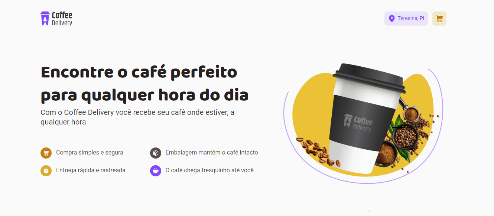
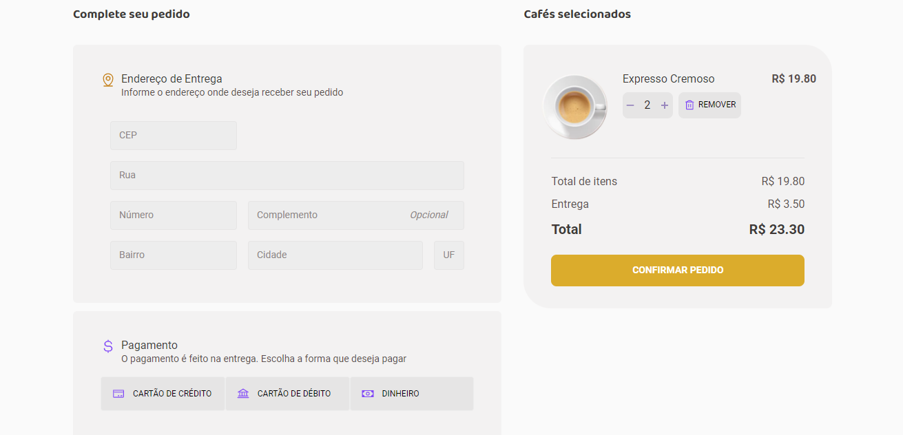
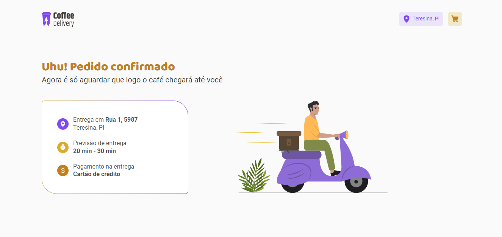

<h1 align="center"> Coffee Delivery App </h1>

 

  
  
  

  <em>Confira o resultado do app em: https://coffee-delivery-app-hevelinlima.vercel.app/</em>

## 💻 Projeto

Coffee Delivery é uma aplicação para gerenciar um carrinho de compras de uma cafeteria fictícia, que contém as seguintes funcionalidades:

- Listagem de cafés disponíveis para compra
- Adicionar uma quantidade específica de itens no carrinho
- Aumentar ou remover a quantidade de itens no carrinho
- Formulário para o usuário preencher o seu endereço
- Exibir o total de itens no carrinho 
- Exibir o valor total da soma de itens no carrinho multiplicados pelo valor

Para o desenvolvimento dessas funcionalidades, foram utilizados conceitos como:

- Estados
- ContextAPI, reducers
- LocalStorage
- Imutabilidade do estado
- Listas e chaves no ReactJS
- Propriedades e componentização
- Styled-components
- React Hook Forms

## 🚀 Tecnologias

Esse projeto foi desenvolvido com as seguintes tecnologias:

- HTML
- CSS
- TypeScript
- React
- Git e Github
- Vite
- Figma
  
---

Feito com ♥ by hevelinlima
